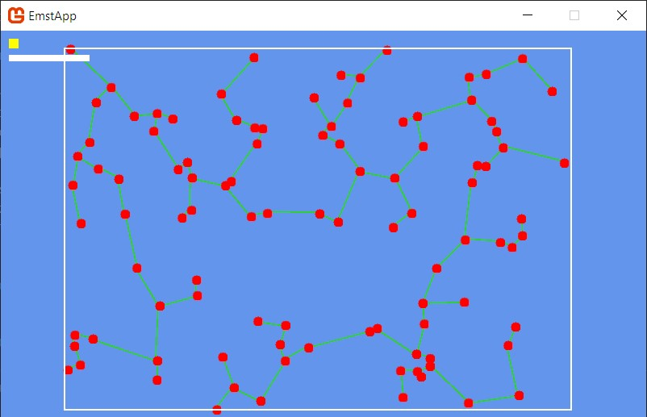

# EMST Visualization Tool

This project visualizes the Euclidean Minimum Spanning Tree (EMST) algorithm using KD-Trees for optimization and Kruskal's algorithm. Implemented in C# with MonoGame for graphics.



## Features

- **EMST visualization** with step-by-step animation
- Customizable point generation with adjustable count and spread
- Interactive controls:
  - Add points by mouse click
  - Zoom and pan the camera
- Optimized algorithms using KD-Trees for efficient neighbor search
- Support for large datasets (up to 10,000 points)
- Visual settings display showing point density and spread

## Technologies

- **C# 13.0** - Primary programming language
- **MonoGame 3.8** - Cross-platform game development framework
- **.NET 8.0** - Runtime environment
- **KD-Trees** - Spatial partitioning data structure
- **Kruskal's Algorithm** - For minimum spanning tree calculation
- **DSU (Disjoint Set Union)** - Efficient set operations

## Installation & Setup

1. Clone the repository:
```bash
git clone https://github.com/8ctag8ne/CGCG.git
```

2. Open solution in Visual Studio 2022

3. Install required NuGet packages:
- MonoGame.Framework.DesktopGL (3.8.1.303)
- MonoGame.Content.Builder.Task (3.8.1.303)

4. Build and run the `EmstApp` project

## Usage

### Controls

| Key            | Action                                     |
|----------------|--------------------------------------------|
| Left Click     | Add point at cursor position               |
| Space + Drag   | Pan camera                                 |
| Mouse Wheel    | Zoom in/out                                |
| C              | Clear all points                           |
| G              | Generate new random points                 |
| M              | Build EMST                                 |
| ↑/↓            | Increase/decrease point count level        |
| +/-            | Increase/decrease point spread             |
| R              | Reset parameters and camera                |

### Settings Display
- **Yellow squares**: Point density level (each square represents a level)
- **Green bar**: Point spread factor

## Architecture

### Core Components
1. **GeometricPrimitives.cs** - Point and Edge classes with geometric operations
2. **KdTree.cs** - Optimized KD-Tree implementation for neighbor searches
3. **DSU.cs** - Disjoint Set Union for efficient connectivity checks
4. **KruskalAlgorithm.cs** - EMST construction logic
5. **PointGenerator.cs** - Random point generation utility
6. **Game1.cs** - Main visualization and interaction logic

### Algorithm Workflow
1. Generate points (random or user-added)
2. Build KD-Tree spatial index
3. Find k-nearest neighbors for each point
4. Construct candidate edge set
5. Apply Kruskal's algorithm with DSU to find EMST
6. Visualize the construction process

## Code Example

```csharp
// Building EMST using KD-Tree optimization
public static List<Edge> BuildEmst(List<Point> points)
{
    var kdTree = new KDTree(points);
    HashSet<Edge> edges = kdTree.GetAllEdges(k: Math.Min(points.Count, 6));
    return FindMst(edges, points);
}
```

---
**Author**: 8ctag8ne  
**Repository**: https://github.com/8ctag8ne/CGCG